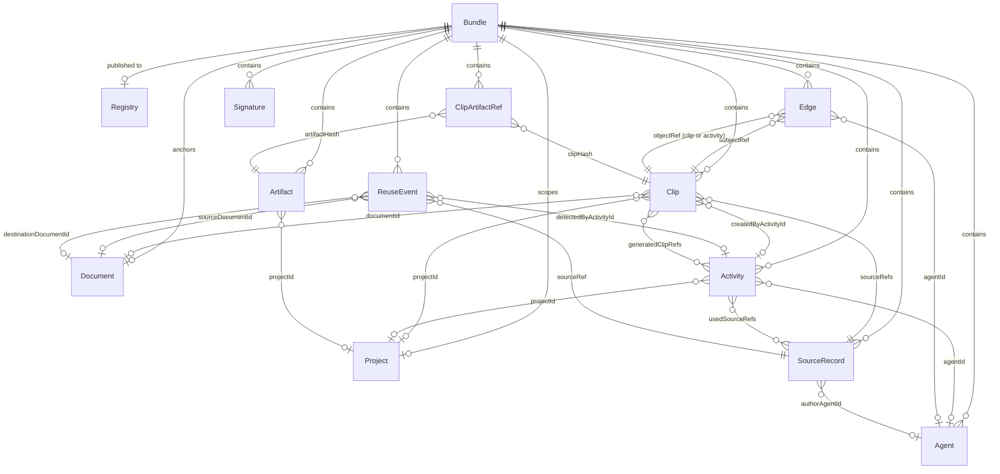
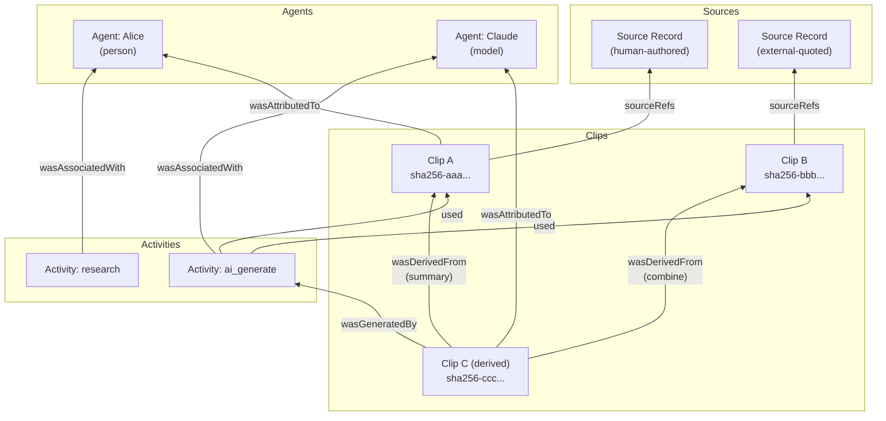

# ClipRoot Protocol (CRP) Specification

**Version:** 0.0.4
**Status:** Draft

---

## Overview

The ClipRoot Protocol (CRP) is an open protocol for **provenance-aware content reuse**. It provides a structured way to capture where content comes from, how it has been transformed, and who was involved — preserving attribution as content moves between documents, tools, and agents.

CRP is designed for a world where content is routinely copied, quoted, summarized, translated, and regenerated by both humans and AI. Rather than treating provenance as an afterthought, CRP makes it a first-class, machine-verifiable property of content.

### Design Principles

- **Content-addressed.** Clips and artifacts are identified by deterministic SHA-256 hashes, enabling integrity verification without a central authority.
- **Lineage-first.** Derivation relationships form a directed acyclic graph (DAG), allowing any piece of content to be traced back to its original sources.
- **Agent-neutral.** Humans, AI models, and automated services are all first-class agents. The protocol does not privilege one over another.
- **Local-first.** CRP bundles are self-contained JSON documents. No network or registry is required to create, verify, or exchange provenance data.
- **Schema-driven.** The canonical protocol definition is a JSON Schema (2020-12). Implementations validate against this schema, not against prose.

### Relationship to W3C PROV

CRP's edge types are inspired by the [W3C PROV Ontology](https://www.w3.org/TR/prov-o/) (PROV-O), which defines a general-purpose model for provenance on the web. CRP adopts PROV-O's core relationship vocabulary (`wasDerivedFrom`, `wasGeneratedBy`, `used`, `wasAttributedTo`, `wasAssociatedWith`, `actedOnBehalfOf`) while adapting the model for content-level granularity — operating on clips and text spans rather than abstract entities.

CRP conforms loosely to PROV-O today and is intended to grow beyond it as the protocol matures, particularly in areas like transformation semantics and confidence scoring that PROV-O does not address.

### Relationship to C2PA

CRP shares terminology and goals with the [Coalition for Content Provenance and Authenticity (C2PA)](https://c2pa.org/) standard. The `digitalSourceType` field on source records is designed to align with the IPTC Digital Source Type vocabulary used by C2PA, enabling interoperability between the two systems. CRP's scope is complementary: where C2PA focuses on media asset authenticity and tamper evidence, CRP focuses on text-level attribution and derivation lineage across authoring and AI workflows.

---

## Terminology

This section defines the core terms used throughout the protocol. Each term corresponds to a data structure in the CRP bundle schema.

### Bundle

A **bundle** is the top-level container in CRP. It is a self-contained JSON document carrying a set of related provenance records. Every CRP exchange — whether writing to clipboard, exporting from a repository, or transmitting over a network — involves one or more bundles.

Bundles are typed by their purpose:

| Bundle Type | Purpose |
|---|---|
| `document` | Provenance records anchored to a specific document |
| `clipboard` | Snapshot of a copy event from a browser or editor |
| `derivation` | Records of content derived from existing clips |
| `reuse-event` | Detection and notification of content reuse |
| `provenance-export` | Portable provenance export for sharing |

### Clip

A **clip** is the fundamental unit of provenance. It represents a specific span of text that has been captured, quoted, or derived, along with enough metadata to verify its integrity and trace its origin.

Every clip has:
- A **content hash** (`clipHash`) that uniquely identifies it based on its text, sources, and quote content.
- A **text hash** (`textHash`) that fingerprints the normalized text content.
- One or more **source references** linking it to source records.
- Optional **selectors** that describe where the text was found (character offsets, quote context, DOM location, editor path, or media timestamp).

Clips are content-addressed: two captures of the same text from the same source produce the same `clipHash`.

### Source Record

A **source record** describes the origin of content — the document, article, or output from which a clip was captured.

Every source has a **source type** that classifies how the content was produced:

| Source Type | Meaning |
|---|---|
| `human-authored` | Written by a person |
| `ai-generated` | Produced entirely by an AI model |
| `ai-assisted` | Human-authored with AI assistance |
| `external-quoted` | Quoted from an external source |
| `unknown` | Origin is not known |

Source records may optionally include a `digitalSourceType` URI, intended to align with the IPTC Digital Source Type vocabulary for interoperability with C2PA and content authenticity workflows.

### Agent

An **agent** is any entity that participates in creating, transforming, or managing content.

| Agent Type | Examples |
|---|---|
| `person` | An author, editor, or researcher |
| `organization` | A company, team, or institution |
| `model` | An AI language model (e.g., Claude, GPT) |
| `service` | An API or SaaS platform |
| `system` | An automated pipeline or script |

### Activity

An **activity** is a discrete action that produces or consumes clips. Activities provide the "when" and "how" of provenance — what prompted the work, which agent performed it, and what was produced.

| Activity Type | Meaning |
|---|---|
| `create` | Original content creation |
| `copy` | Clipboard copy event |
| `paste` | Clipboard paste event |
| `import` | Ingestion from an external source |
| `edit` | Modification of existing content |
| `derive` | Creation of new content from existing clips |
| `ai_generate` | AI-generated output |
| `research` | Gathering and capturing source material |
| `plan` | Planning or outlining work |
| `review` | Review or verification of content |
| `reuse_detected` | Automated detection of reused content |
| `reuse_notified` | Notification sent about detected reuse |

Activities can record a `prompt` (for AI-driven activities), `parameters` (model settings, thresholds), and timestamps (`createdAt`, `endedAt`) to bound the duration of work.

### Edge

An **edge** is a directed relationship between two entities in the provenance graph. Edges connect clips to their parents, agents, and activities, forming the DAG that makes lineage traceable.

| Edge Type | Subject | Object | Meaning |
|---|---|---|---|
| `wasDerivedFrom` | Clip | Clip | Subject was derived from object |
| `wasGeneratedBy` | Clip | Activity | Subject was produced by the activity |
| `used` | Activity | Clip | Activity consumed the clip as input |
| `wasAttributedTo` | Clip | Agent | Clip is attributed to the agent |
| `wasAssociatedWith` | Activity | Agent | Agent was responsible for the activity |
| `actedOnBehalfOf` | Agent | Agent | Subject agent acted on behalf of object agent |

Edges may carry a **transformation type** (on `wasDerivedFrom` edges) that describes how content changed:

| Transformation | Meaning |
|---|---|
| `verbatim` | Exact copy, no changes |
| `quote` | Quoted with minor formatting changes |
| `summary` | Condensed version of the original |
| `paraphrase` | Rewritten in different words |
| `translate` | Translated to another language |
| `combine` | Merged from multiple sources |
| `edit` | Modified or revised |
| `ai_generate` | Produced by an AI model from the input |
| `unknown` | Transformation type is not known |

Edges may also carry a `confidence` score (0.0 to 1.0) indicating the certainty of the relationship, useful for automatically detected derivations.

### Artifact

An **artifact** is a content-addressed file or blob attached to a project. Artifacts store supporting material — plans, prompts, session transcripts, diagrams, configurations — alongside the clips they relate to.

| Artifact Type | Typical Use |
|---|---|
| `markdown` | Plans, notes, documentation |
| `prompt` | AI prompts or instructions |
| `session` | Agent session transcripts |
| `config` | Configuration files |
| `diagram` | Visual diagrams or charts |
| `text` | Plain text files |
| `json` | Structured data |
| `binary` | Binary files (images, PDFs, etc.) |
| `unknown` | Unclassified |

Artifacts are linked to clips through **clip-artifact references**, which describe the relationship:

| Relationship | Meaning |
|---|---|
| `generated_from` | Artifact was generated from the clip |
| `cited_in` | Clip is cited within the artifact |
| `prompt_for` | Artifact was the prompt that produced the clip |
| `attached_to` | General attachment |
| `unknown` | Relationship is not specified |

### Project

A **project** is an optional organizational scope. Clips, activities, and artifacts can be tagged with a `projectId` to group related provenance records — for example, all research and derived content for a specific investigation or feature.

### Document

A **document** represents a specific source or target document. Clips reference documents by ID, and documents may carry a `canonicalHash` for integrity verification of the full document content.

### Reuse Event

A **reuse event** tracks the detection and lifecycle of content reuse. When content matching a known clip is found in a new location, a reuse event records the detection, any notification sent, and the response.

| Status | Meaning |
|---|---|
| `detected` | Reuse was detected |
| `notified` | The original author/owner was notified |
| `acknowledged` | The reuse was acknowledged |
| `rejected` | The reuse was contested or rejected |

### Signature

A **signature** provides cryptographic attestation over a bundle. Signatures are optional and extensible.

| Algorithm | Standard |
|---|---|
| `Ed25519` | EdDSA over Curve25519 |
| `ES256` | ECDSA over P-256 |
| `RS256` | RSASSA-PKCS1-v1_5 with SHA-256 |

Signatures are encoded as JWS (JSON Web Signature) compact serialization and may include a `kid` (key ID) for key resolution.

### Registry

A **registry reference** is an optional pointer to an external registry where a bundle has been published. The `uri` identifies the registry and `bundleId` identifies the specific bundle within it. This field is a placeholder for planned registry infrastructure.

---

## Bundle Structure

A CRP bundle is a JSON object with the following top-level shape:

```json
{
  "protocolVersion": "0.0.4",
  "bundleType": "document",
  "createdAt": "2026-03-07T20:30:00Z",
  "project": { ... },
  "document": { ... },
  "agents": [ ... ],
  "sources": [ ... ],
  "clips": [ ... ],
  "artifacts": [ ... ],
  "clipArtifactRefs": [ ... ],
  "activities": [ ... ],
  "edges": [ ... ],
  "reuseEvents": [ ... ],
  "signatures": [ ... ],
  "registry": { ... }
}
```

**Required fields:** `protocolVersion`, `bundleType`, `createdAt`.

All array fields default to empty arrays. `project`, `document`, `registry` are optional objects.

The canonical schema is defined in `schema/crp-v0.0.4.schema.json` using JSON Schema 2020-12. Implementations must validate bundles against this schema.

---

## Entity Relationships

The following diagram shows how CRP entities relate to each other:



## Provenance Graph Model

At its core, CRP models provenance as a directed acyclic graph (DAG). The nodes are clips, agents, and activities. The edges are typed relationships drawn from the W3C PROV vocabulary.

The following diagram illustrates a typical provenance graph for a derived clip:



### Reading the Graph

- **Trace a clip to its sources:** Follow `wasDerivedFrom` edges backward (recursively) until you reach clips with no parents. Those root clips link to source records via `sourceRefs`.
- **Understand how content changed:** The `transformationType` on each `wasDerivedFrom` edge describes the transformation (verbatim, summary, paraphrase, etc.).
- **Identify who did what:** `wasAttributedTo` links clips to agents. `wasAssociatedWith` links activities to agents. `actedOnBehalfOf` links agents to other agents (e.g., an AI model acting on behalf of a researcher).
- **Reconstruct the timeline:** Activities have `createdAt` and `endedAt` timestamps. Edges have `createdAt`. These form a partial ordering of events.

---

## Selectors

Selectors describe *where* a clip's text was found in its source. A clip may have multiple selector types for the same span, providing redundant anchoring for robustness.

### Text Quote Selector

Captures the exact text and its surrounding context:

```json
{
  "textQuote": {
    "exact": "Provenance starts here.",
    "prefix": "Introduction: ",
    "suffix": " End of section."
  }
}
```

`prefix` and `suffix` are optional context windows that help re-anchor the quote if the document changes.

### Text Position Selector

Character offsets within the document:

```json
{
  "textPosition": {
    "start": 0,
    "end": 23
  }
}
```

### DOM Selector

Location within an HTML/XML document:

```json
{
  "dom": {
    "elementId": "paragraph-1",
    "cssSelector": "article > p:nth-child(2)",
    "classPath": "article-body p.lede",
    "provenanceAttribute": "data-crp-hash"
  }
}
```

At least one property must be present. All properties are optional individually.

### Markdown Selector

Location within a Markdown document. Markdown has no single stable addressing scheme, so the selector exposes several redundant anchors — analogous to the DOM selector — and implementations should populate as many as are available:

```json
{
  "markdown": {
    "headingSlug": "markdown-selector",
    "headingPath": ["Selectors", "Markdown Selector"],
    "blockId": "block-abc123",
    "managedBlockField": "intro",
    "lineRange": { "start": 342, "end": 358 },
    "provenanceAttribute": "data-crp-hash"
  }
}
```

- `headingSlug` — GitHub-style slug of the nearest enclosing heading (e.g. `markdown-selector`). Re-anchors the clip if line numbers shift but the heading is stable.
- `headingPath` — ordered list of heading titles from document root to the nearest enclosing heading. Survives heading renames better than slugs when only one level changes, and disambiguates duplicate headings in different sections.
- `blockId` — block reference identifier (e.g. Obsidian-style `^block-abc123`) when the source Markdown uses inline block IDs.
- `managedBlockField` — name of the enclosing `cliproot:begin field="<name>"` managed block, when the clip lies inside one (see [Managed Blocks](#managed-blocks)).
- `lineRange` — 1-indexed inclusive line range within the raw Markdown bytes. Precise but brittle under edits; include alongside other anchors, not in isolation.
- `provenanceAttribute` — name of the HTML attribute carrying the clip hash when the clip is anchored by an inline `<span data-crp-hash="…">` (see [Markdown Transport](#markdown-transport)). Defaults to `data-crp-hash`.

At least one property must be present. All properties are optional individually. A `textQuote` selector should almost always accompany a `markdown` selector, since none of the above anchors are bit-stable against routine editing.

### Editor Path Selector

Path within a structured editor (e.g., ProseMirror/Tiptap node path):

```json
{
  "editorPath": "0/0/0"
}
```

### Media Time Selector

Timestamp range within audio or video:

```json
{
  "mediaTime": {
    "startMs": 15000,
    "endMs": 30000,
    "track": "audio",
    "transcriptCueId": "cue-42"
  }
}
```

### Parent Clip Hash

For derived clips, the selector may reference the parent clip by hash:

```json
{
  "parentClipHash": "sha256-abc123..."
}
```

---

## Identifiers

CRP uses two types of identifiers:

### Content Hashes (`sha256-...`)

Content-addressed identifiers derived from the data they identify. Used for clips (`clipHash`, `textHash`), artifacts (`artifactHash`), and documents (`canonicalHash`).

Format: `sha256-` followed by base64url-encoded SHA-256 digest (no padding).

Pattern: `^sha256-[A-Za-z0-9_-]{43,}$`

See [hashing.md](hashing.md) for the exact algorithms.

### Entity IDs

Human-readable identifiers for entities that are not content-addressed: agents, sources, activities, projects, documents, edges, reuse events, signatures.

Constraints:
- 1 to 128 characters
- Alphanumeric plus `.`, `_`, `:`, `-`
- Pattern: `^[A-Za-z0-9._:-]+$`

IDs are scoped to the bundle. Cross-bundle references use content hashes (for clips and artifacts) or require identifier coordination by convention.

---

## Markdown Transport

CRP bundles and clip references can be embedded inline in Markdown documents. This enables provenance data to travel with prose through clipboards, editors, and static-site pipelines without requiring a separate bundle file.

Two embed shapes coexist. Each has a default use; both are valid in any document.

| Shape | Embed form | Default use |
|---|---|---|
| **Hash-only** | `<span data-crp-hash="sha256-<hash>"></span>` | Content under cliproot's control (e.g. a managed knowledge base). The backing store is authoritative; the Markdown indexes into it by hash. |
| **Full bundle** | `<div style="display:none" data-crp-bundle="<escaped JSON>"></div>` | Exports, one-off shared documents, and clipboard output. The Markdown *is* the data and must be self-sufficient when it leaves the authoring environment. |

The `data-crp-hash` attribute is the same attribute already named by the DOM selector's `provenanceAttribute` field (see [Selectors](#dom-selector)). Reusing it for inline Markdown is deliberate: a hash embedded in rendered HTML and a hash embedded in source Markdown refer to the same clip in the same way.

### Anchoring Clips in Markdown Sources

When a clip is *captured from* a Markdown document (as opposed to *embedded in* one), the capture should record a [Markdown Selector](#markdown-selector) describing where in the source the clip came from — heading slug, heading path, block ID, managed-block field name, and/or line range. This mirrors how HTML captures populate a DOM selector: Markdown has no single authoritative addressing scheme, so selectors are redundant by design, and a `textQuote` selector should always accompany the structural anchors to allow re-anchoring when the document changes.

### Clipboard Default

When CRP is written to the system clipboard, the default shape is **full bundle**. This ensures a paste into a reader without network access or a cliproot-aware store still carries complete provenance.

### Managed Blocks

Regions of a Markdown document that are regenerated by tooling are delimited by HTML comment markers:

```
<!-- cliproot:begin field="<name>" -->
…
<!-- cliproot:end field="<name>" -->
```

`<name>` identifies the region. Tooling replaces content between matching markers; content outside is preserved. Marker comments are HTML comments so they survive most Markdown processors.

### Escaping

The JSON bundle payload embedded in `data-crp-bundle` must be HTML-attribute-escaped: `&`, `<`, `>`, `"`, and `'` are replaced with their named or numeric HTML entities. Decoders reverse the escape before JSON-parsing.

### Frontmatter

YAML frontmatter is reserved for document-identity fields (such as a stable UUID, a content hash of the document itself, canonical keys, and article type). Provenance records belong in `data-crp-hash` spans or `data-crp-bundle` divs, not in frontmatter.

### Round-Trip Hazards

Markdown processors and editors vary in how they handle inline HTML. Implementations should be aware of:

- **Comment-stripping converters.** Some pipelines (e.g. pandoc `--strip-comments`) remove HTML comments, which destroys managed-block markers. Round-trip workflows must preserve comments or re-anchor by other means.
- **Self-closing-span normalization.** Some Markdown-AST libraries (e.g. remark under certain configurations) rewrite `<span …></span>` into a self-closing or otherwise altered form. Use an explicit open/close pair and verify that the chosen toolchain preserves empty spans.
- **Editor plugins.** Rich-text editors (e.g. Obsidian with community plugins) may reflow, merge, or strip inline HTML. Authors should confirm that provenance spans survive a save/reload cycle in their editor of choice.

When in doubt, validate by round-tripping a document through the full authoring pipeline and checking that every `data-crp-hash` and `data-crp-bundle` attribute is preserved verbatim.

---

## Canonical Schema

The authoritative protocol definition is the JSON Schema file:

```
schema/crp-v0.0.4.schema.json
```

This schema uses JSON Schema 2020-12 and defines all entity structures, field constraints, enumerations, and required fields. Implementations should validate bundles against this schema to ensure conformance.

Supporting schemas:
- `schema/cliproot-pack-v1.manifest.schema.json` — Pack archive manifest format
- `schema/examples/` — Example bundles for testing and reference
